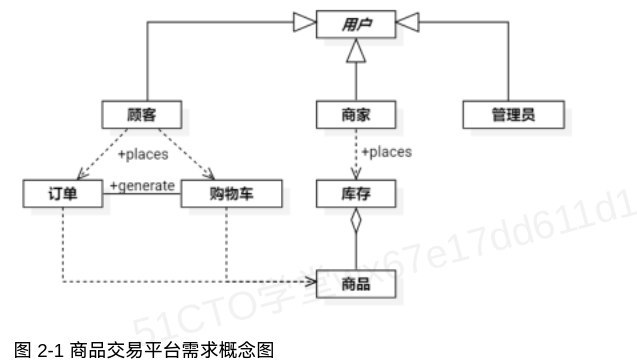

# 商品交易平台_UML分析

## 题目说明

某畜牧饲料公司欲建设一套面向互联网的商品交易平台，该平台可以方便畜牧业养殖户与饲料公司之间的询价与交易。参考目前的电子商务模式，该平台的主要需求可参考下图，需求图2-1商品交易平台需求概念图

具体描述如下：

1.平台主要分为商家、顾客和管理员三类用户。商家代表在平台上发布供应和商品的用户，顾客代表在平台上下采购订单的用户，管理员代表平台上的运营和维护人员。

2.商家在注册账户后获得一个店铺，店铺拥有库存，库存中存放商品记录。商家可以通过添加商品和追加库存的方式，向库存中添加店铺中可销售的商品。通过标记商品上/下架状态或调整库存的方式设置商品是否在店铺中展示和销售。当商品库存为0时，不会出现在商家店铺中。

3.顾客在浏览商家店铺和商品的过程中可以直接下订单(3.1)，或将商品加入购物车(3.2)，然后再使用购物车生成订单(3.3)。

3.1顾客在浏览到某个合意的商品时，可直接填写商品数量并生成订单；

3.2顾客在浏览到某个合意的商品时，可将商品添加到购物车中。添加时可提前填入商品数量，也可未来在购物车中修改商品数量；

3.3在购物车中，顾客可以移除商品，也可以调整购买商品的数量。顾客可以通过复选框勾选部分商品或全部商品，然后通过生成订单按钮依据选中商品生成一个新得订单。

---

## 问题4

【问答题】

【问题4】(5分)

图2-1中绘制的类是分析类还是设计类？分析类和设计类分别会在软件生命周期模型中的哪个或哪些阶段中产生？

### 参考答案：

图中的类是分析类。

分析类主要在需求分析和架构设计中产生，设计类主要在概要设计阶段产生。

---

## 相关知识

- [[../wiki/concepts/软件生命周期模型]]
- [[../wiki/concepts/面向对象分析]]
- [[../wiki/summaries/11.5.2分析模型]]
- [[../wiki/summaries/13.4.1设I卜软件类]]