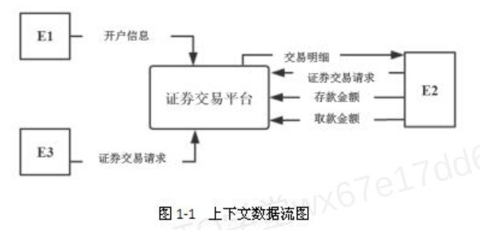
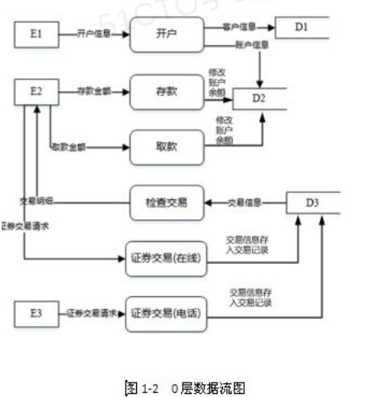

# 证券交易平台案例题

> 来源：系统分析师下午案例分析
> 整理时间：2026-05-21

## 【说明】

阅读下列说明，回答问题1至问题4，将解答填入答题纸的对应栏内。

某证券交易所为了方便提供证券交易服务，欲开发一证券交易平台，该平台的主要功能如下：

(1)开户。根据客户服务助理提交的开户信息，进行开户，并将客户信息存入客户记录中，账户信息（余额等）存入账户记录中；

(2)存款。客户可以向其账户中存款，根据存款金额修改账户余额；

(3)取款。客户可以从其账户中取款，根据取款金额修改账户余额；

(4)证券交易。客户和经纪人均可以进行证券交易（客户通过在线方式，经纪人通过电话），将交易信息存入交易记录中；

(5)检查交易。平台从交易记录中读取交易信息，将交易明细返回给客户。

现采用结构化方法对该证券交易平台进行分析与设计，获得如图1-1所示的上下文数据流图和图1-2所示的0层数据流图。

---

## 【问题1】(6分)

使用说明中的词语，给出图1-1中的实体E1-E3的名称，以及图1-2中的数据存储D1-D3的名称。

### 参考答案

E1:客户服务助理，E2:客户，E3:经纪人。

D1:客户记录，D2:账户记录，D3:交易记录

---

## 【问题2】(10分)

用200字以内的文字简述结构化开发方法的核心思想。除了数据流图外结构化分析还包括哪些工具

### 参考答案

结构化方法的核心思想是"自顶向下，逐步分解”。特别适合于数据处理领域的问题，但是不适合解决大规模的、特别复杂的项目，且难以适应需求的变化。

结构化分析一般包括以下工具：数据流图(Data Flow Diagram,DFD)、数据字典(Data Dictionary,DD)、结构化语言、判定表、判定树。

---

## 【问题3】(9分)

系统设计是系统分析的延伸与拓展。系统分析阶段解决"做什么"的问题，而系统设计阶段解决"怎么做"的问题。同时，它也是系统实施的基础，为系统实施工作做好铺垫。

系统设计的主要内容包括概要设计和详细设计。请简述两个过程的主要任务。

### 参考答案

概要设计主要任务是将**系统的功能需求分配给软件模块**，确定每个模块的功能和调用关系，形成软件的模块结构图，即系统结构图。在概要设计中，将系统开发的总任务分解成许多个基本的、具体的任务，**为每个具体任务选择适当的技术手段和处理方法的过程**称为详细设计。

---

## 📝 要点记忆

- 外部实体E1-E3：**客户服务助理、客户、经纪人**
- 数据存储D1-D3：**客户记录、账户记录、交易记录**
- 结构化核心思想：**自顶向下，逐步分解**
- 结构化分析工具：**DFD、数据字典、结构化语言、判定表、判定树**
- 概要设计 → 形成**模块结构图/系统结构图**
- 详细设计 → 为具体任务选择**技术手段和处理方法**

---

**相关知识**：[[concepts/数据流图]] | [[concepts/结构化分析]] | [[summaries/11.4.1数据流图]]